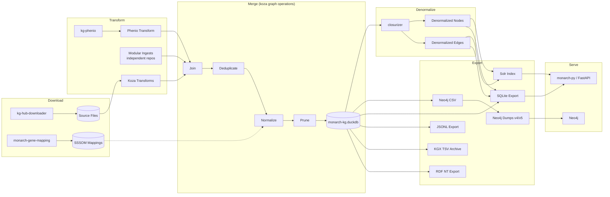

# Monarch KG Build Process

## Download
At the start of the KG build, [KGHub Downloader](https://github.com/monarch-initiative/kghub-downloader) reads from [download.yaml](https://github.com/monarch-initiative/monarch-ingest/blob/main/src/monarch_ingest/download.yaml) to download data files. Some post-processing is done in [after_download.sh](https://github.com/monarch-initiative/monarch-ingest/blob/main/scripts/after_download.sh) — repairing SSSOM prefixes, filtering the phenio relation graph, etc.

Note that modular ingests (see Transform below) handle their own download and transform independently on their own schedules, publishing pre-built KGX files as release artifacts. The download step here covers ontologies, mapping files, and data for Koza-based ingests that run locally.

## Transform

The [`ingest` CLI](https://github.com/monarch-initiative/monarch-ingest/blob/main/src/monarch_ingest/main.py) runs each source ingest defined in [ingests.yaml](https://github.com/monarch-initiative/monarch-ingest/blob/main/src/monarch_ingest/ingests.yaml), producing [KGX tsv](https://github.com/biolink/kgx/blob/master/specification/kgx-format.md) output.

### Source Ingests

Ingests are documented individually in the Sources section of this documentation. There are two kinds of ingests:

- **Koza ingests** use a local [Koza](https://github.com/monarch-initiative/koza) transform configuration to read from downloaded source files and produce KGX node/edge TSV files.
- **Modular ingests** download pre-built KGX TSV files from separate ingest repositories managed on [KozaHub](https://kozahub.monarchinitiative.org) (e.g. [bgee-ingest](https://github.com/monarch-initiative/bgee-ingest), [string-ingest](https://github.com/monarch-initiative/string-ingest)). These repos run their own Koza transforms and publish the output as release artifacts.

Ingests are either node or edge specific, and use IDs as defined in the source data files without additional re-mapping of identifiers. The primary role they have is to represent sources in biolink model and KGX format, and secondarily they may also subset from the source files. The output of individual ingests can be found in the [transform_output](https://data.monarchinitiative.org/monarch-kg-dev/latest/transform_output/index.html) directory in each release.

### Phenio-KG

Ontologies in Monarch are built first as [Phenio](https://github.com/monarch-initiative/phenio), then converted into the biolink model and represented as KGX in [kg-phenio](https://github.com/Knowledge-Graph-Hub/kg-phenio).

The `ingest` CLI's `transform_phenio` method performs further filtering on the kg-phenio node and edge files, limiting to nodes and edges that match a subset of curie namespaces, validating categories and predicates against the biolink model, and limiting edge property columns to a relevant subset.

## Merge

With all transforms complete, the individual KGX node and edge files in `output/transform_output` can be combined into a merged graph. This is done by the `merge` command in the `ingest` CLI.

At this point, the individual node and edge KGX files from the transforms may not have matching IDs, and in fact, we may have edges that point to nodes that are not present in our canonical node sources (e.g. a STRING edge that points to an ENSEMBL gene that can't be mapped to HGNC).

The merge process is broken down into join, deduplicate, normalize, and prune steps, implemented using [koza graph operations](https://github.com/monarch-initiative/koza). The merge output is a DuckDB database (`monarch-kg.duckdb`) that serves as the central artifact for all downstream steps.

### Join

The first step loads all node KGX files into a single nodes table and all edge KGX files into a single edges table in DuckDB.

### Deduplicate

After joining, duplicate nodes and edges (by ID) are removed.

### Normalize

The normalize step replaces subject and object IDs in edge files using [SSSOM](https://github.com/mapping-commons/sssom) mapping files, with the IDs from the initial ingests stored in `original_subject` and `original_object` fields.

Three SSSOM mapping files are used:

- **Gene mappings** generated by our [monarch-gene-mapping](https://github.com/monarch-initiative/monarch-gene-mapping) process, available at [data.monarchinitiative.org](https://data.monarchinitiative.org/mappings/latest/).
- **Disease mappings** from the MONDO SSSOM.
- **Chemical mappings** from MeSH-ChEBI biomappings.

This step requires that the subject of the SSSOM file be our canonical ID, and the object be the non-canonical ID. There is room for improvement here.

### Prune

After edges have been normalized, it's important to cull edges that point to nodes that don't exist in the graph. The prune step performs joins against the node table to split out these edges into their own `dangling_edges` table that can be used for QC purposes.

A group of edges that wind up in this table could be due to a number of reasons:

* We're missing an ontology or other node source that is required for an ingest/source: this is something we want to fix
* We're missing a mapping necessary to translate between an edge ingest and our canonical node sources: this is something we want to fix
* The edge ingest includes edges which can't be mapped to our canonical node sources: this is a feature!

We have a visualization of this split between connected and dangling edges for each ingest on our [QC Dashboard](https://monarch-initiative.github.io/monarch-qc/) that we can use to problem-solve our mappings and node sources.

## Denormalize

For Solr (and secondarily SQLite) we produce denormalized node and edge files, which include additional details such as category, namespace/prefix, and ontology ancestor closures following the GOLR pattern (ID and label closure lists). This is done by the `ingest closure` command using the [closurizer](https://github.com/monarch-initiative/closurizer) library.

The closure file is generated by relation-graph and included in the kg-phenio download. The `after_download.sh` script makes a filtered version (`phenio-relation-filtered.tsv`) that only includes `rdfs:subClassOf`, `BFO:0000050`, and `UPHENO:0000001`.

## Neo4j

Neo4j dumps are produced in two steps. First, `ingest neo4j-csv` exports nodes and edges from the DuckDB database into CSV files formatted for Neo4j import (with `:ID`, `:LABEL`, `:START_ID`, `:TYPE`, `:END_ID` headers and biolink category ancestry expansion). Then, [scripts/load_neo4j.sh](https://github.com/monarch-initiative/monarch-ingest/blob/main/scripts/load_neo4j.sh) uses `neo4j-admin import` in Docker containers to produce both Neo4j v4 and v5 database dumps.

## SQLite

A SQLite database is produced by the `ingest sqlite` command, which uses DuckDB's SQLite extension to copy tables directly from the DuckDB database. The following tables are included: `nodes`, `edges`, `denormalized_nodes`, `denormalized_edges`, `dangling_edges`, and `closure`. A separate `phenio.db` is also populated with gene/disease-to-phenotype associations. Both databases are compressed with pigz.

## Solr

Our Solr index is loaded from the DuckDB database using [LinkML-Solr](https://github.com/linkml/linkml-solr/tree/main/linkml_solr). The [LinkML schema](https://github.com/monarch-initiative/monarch-app/blob/main/backend/src/monarch_py/datamodels/model.yaml) for the Solr index lives in the monarch-app backend (see documentation for [Entity](https://monarch-initiative.github.io/monarch-py/Data-Model/Entity/) and [Association](https://monarch-initiative.github.io/monarch-py/Data-Model/Association/) classes).

LinkML-Solr starts Solr in Docker via the `lsolr` command, defines the Solr schema based on the LinkML schema, and then bulk loads data from DuckDB tables. There are four Solr cores: **entity** (from `denormalized_nodes`), **association** (from `denormalized_edges`), **sssom** (from `mappings`), and **infores** (from the information resource catalog). Additional Solr configuration — [field types](https://github.com/monarch-initiative/monarch-ingest/blob/main/scripts/add_fieldtypes.sh), [entity copy-fields](https://github.com/monarch-initiative/monarch-ingest/blob/main/scripts/add_entity_copyfields.sh), [association copy-fields](https://github.com/monarch-initiative/monarch-ingest/blob/main/scripts/add_association_copyfields.sh), and a [frequency update processor](https://github.com/monarch-initiative/monarch-ingest/blob/main/scripts/add_update_processor.sh) — is applied via curl commands in shell scripts.

Our Solr load process is defined in [scripts/load_solr.sh](https://github.com/monarch-initiative/monarch-ingest/blob/main/scripts/load_solr.sh).
