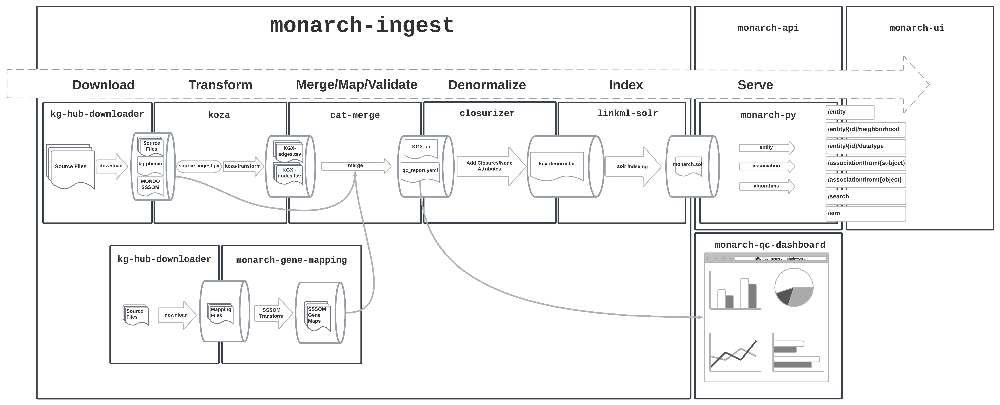

# Monarch KG Build Process

## Download
A weekly job independent from the KG build process runs to download data sources and store them on a cloud bucket. This replaces [DipperCache](https://github.com/monarch-initiative/DipperCache) from the old pipeline. [KGHub Downloader](https://github.com/monarch-initiative/kghub-downloader) reads from [downloads.yaml](https://github.com/monarch-initiative/monarch-ingest/blob/main/src/monarch_ingest/download.yaml) to download each file. Some post-processing is done in [a shell script](https://github.com/monarch-initiative/monarch-ingest/blob/main/scripts/after_download.sh) before the files are uploaded to the cloud bucket.

At the start of the main ingest build, data files are copied from the cloud bucket.

## Transform

A call to the [ingest](https://github.com/monarch-initiative/monarch-ingest/blob/main/src/monarch_ingest/main.py) command line tool runs each source ingest defined in [ingest.yaml](https://github.com/monarch-initiative/monarch-ingest/blob/main/src/monarch_ingest/ingests.yaml), producing both [KGX tsv](https://github.com/biolink/kgx/blob/master/specification/kgx-format.md) and RDF nt output. 

### Source Ingests

Ingests are documented individually in the Sources section of this documentation. Ingests are either node or edge specific, and use IDs as defined in the source data files without additional re-mapping of identifiers. The primary role they have is to represent sources in biolink model and KGX format, and secondarily they may also subset from the source files. The output of individual ingests can be found in the [transform_output](https://data.monarchinitiative.org/monarch-kg-dev/latest/transform_output/index.html) directory in each release.

### Phenio-KG

Ontologies in Monarch are built first as [Phenio](https://github.com/monarch-initiative/phenio), then converted into the biolink model and represented as KGX in [kg-phenio](https://github.com/Knowledge-Graph-Hub/kg-phenio). 

The `ingest` CLI has transform_phenio method then performs some further filtering on the kg-phenio node and edge files. Limiting to nodes and edges that match a subset of curie namespaces, and limiting node property columns to a relevant subset.

## Merge

With all transforms complete, the individual kgx node and edge files in `output/transform_output` can be combined into a merged graph. This is done by the `merge` command in the `ingest` CLI. 

At this point, the individual node and edge KGX files from the transforms may not have matching IDs, and in fact, we may have edges that point to nodes that are not present in our canonical node sources (e.g. a STRING edge that points to an ENSEMBL gene that can't be mapped to HGNC). 

The merge process is broken down into join, normalize, and prune steps, implemented using [koza graph operations](https://github.com/monarch-initiative/koza).

### Join

The first step loads all node KGX files into a single nodes table and all edge KGX files into a single edges table in DuckDB.

### Normalize

The normalize step replaces subject and object IDs in edge files using [SSSOM](https://github.com/mapping-commons/sssom) mapping files, with the IDs from the initial ingests stored in `original_subject` and `original_object` fields.

Mappings for genes are generated in our [monarch-gene-mapping](https://github.com/monarch-initiative/monarch-gene-mapping) process, and are available at [data.monarchinitiative.org](http://data.monarchinitiative.org/monty-gene-mapping/).

Diseases are mapped using the MONDO SSSOM.

This step requires that the subject of the SSSOM file be our canonical ID, and the object be the non-canonical ID. There is room for improvement here.

### Prune

After edges have been normalized, it's important to cull edges that point to nodes that don't exist in the graph. The prune step performs joins against the node table to split out these edges into their own table ([dangling_edges](https://data.monarchinitiative.org/monarch-kg-dev/latest/monarch-kg-denormalized-edges.tsv.gz)) that can be used for QC purposes.

A group of edges that wind up in this file could be due to a number of reasons:
* We're missing an ontology or other node source that is required for an ingest/source: this is something we want to fix 👎
* We're missing mapping necessary to translate between an edge ingest and our canonical node sources: this is something we want to fix 👎
* The edge ingest includes edges which can't be mapped to our canonical node sources: this is a feature! 👍

We have a visualization of this split between connected and dangling edges for each ingest on our [QC Dashboard](https://monarch-initiative.github.io/monarch-qc/) that we can use to problem-solve our mappings and node sources.

## Neo4j

A neo4j dump is created using the merged tar.gz file using KGX's neo4j loader and a docker container. This process is defined directly in the [Jenkinsfile](https://github.com/monarch-initiative/monarch-ingest/blob/main/Jenkinsfile).

## Denormalize 

For Solr (and secondarily SQLite) we produce a denormalized edge file, which includes additional details for the subjects and objects of each edge, including the category, namespace/prefix, and ontology ancestor closures following the GOLR pattern (ID and label closure lists). The closure file is generated by relation-graph and are included in the kg-phenio download. The after_download script makes a filtered version that only includes `rdfs:subClassOf`, `BFO:0000050`, and `UPHENO:0000001`.

## SQLite

A SQLite database file is produced by loading node and edge files into a SQLite database using [a simple shell script](https://github.com/monarch-initiative/monarch-ingest/blob/main/scripts/load_sqlite.sh), along with the primary node and edge tables, edge tables for danging and denormalized edges are included as well. 

## Solr

Our solr index is loaded directly from the node kgx tsv file and the denormalized edge tsv file using [LinkML-Solr](https://github.com/linkml/linkml-solr/tree/main/linkml_solr). The [LinkML](https://linkml.io/linkml/) [schema](https://github.com/monarch-initiative/monarch-py/blob/main/src/monarch_py/datamodels/model.yaml) for the Solr index is lives in the monarch-py data access library (see documentation for [Entity](https://monarch-initiative.github.io/monarch-py/Data-Model/Entity/) and [Association](https://monarch-initiative.github.io/monarch-py/Data-Model/Association/) classes). 

LinkML-Solr starts Solr in docker via the `lsolr` command, defines the Solr schema based on the LinkML Schema and then bulk loads the data. Currently, a small amount of additional Solr configuration ([defining new field types](https://github.com/monarch-initiative/monarch-ingest/blob/main/scripts/add_entity_fieldtypes.sh), and [copy-fields declarations](https://github.com/monarch-initiative/monarch-ingest/blob/main/scripts/add_entity_copyfields.sh) to fill them) is done via curl commands in shell scripts. 

Our solr load process is defined in [scripts/load_solr.sh](https://github.com/monarch-initiative/monarch-ingest/blob/main/scripts/load_solr.sh)

